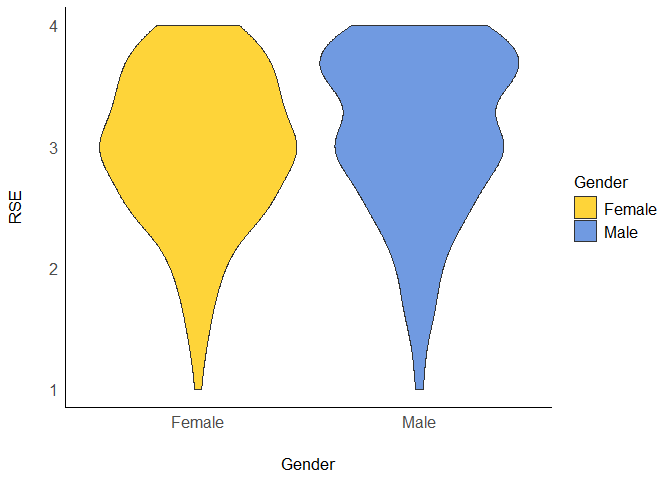
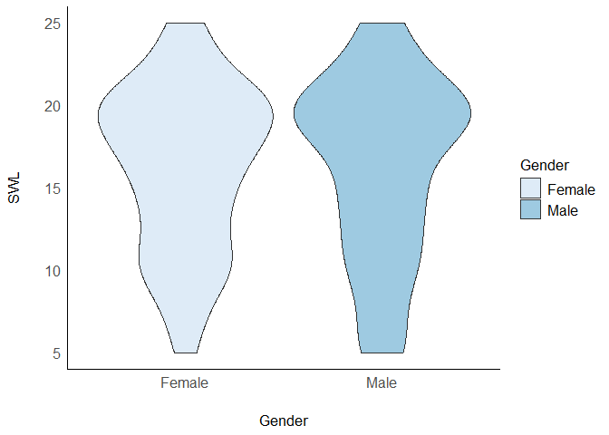

Lab3
================
Can Zhang
2024-09-19

# Load Packages

``` r
library(haven)
library(dplyr)
```

    ## 
    ## Attaching package: 'dplyr'

    ## The following objects are masked from 'package:stats':
    ## 
    ##     filter, lag

    ## The following objects are masked from 'package:base':
    ## 
    ##     intersect, setdiff, setequal, union

``` r
library(tidyr)
library(ggplot2)
library(psych)
```

    ## 
    ## Attaching package: 'psych'

    ## The following objects are masked from 'package:ggplot2':
    ## 
    ##     %+%, alpha

``` r
library(bruceR)
```

    ## 
    ## bruceR (v2024.6)
    ## Broadly Useful Convenient and Efficient R functions
    ## 
    ## Packages also loaded:
    ## ✔ data.table ✔ emmeans
    ## ✔ dplyr      ✔ lmerTest
    ## ✔ tidyr      ✔ effectsize
    ## ✔ stringr    ✔ performance
    ## ✔ ggplot2    ✔ interactions
    ## 
    ## Main functions of `bruceR`:
    ## cc()             Describe()  TTEST()
    ## add()            Freq()      MANOVA()
    ## .mean()          Corr()      EMMEANS()
    ## set.wd()         Alpha()     PROCESS()
    ## import()         EFA()       model_summary()
    ## print_table()    CFA()       lavaan_summary()
    ## 
    ## For full functionality, please install all dependencies:
    ## install.packages("bruceR", dep=TRUE)
    ## 
    ## Online documentation:
    ## https://psychbruce.github.io/bruceR
    ## 
    ## To use this package in publications, please cite:
    ## Bao, H.-W.-S. (2024). bruceR: Broadly useful convenient and efficient R functions (Version 2024.6) [Computer software]. https://CRAN.R-project.org/package=bruceR

    ## 
    ## These packages are dependencies of `bruceR` but not installed:
    ## - pacman, openxlsx, ggtext, lmtest, vars, phia, MuMIn, BayesFactor, GGally
    ## 
    ## ***** Install all dependencies *****
    ## install.packages("bruceR", dep=TRUE)

``` r
library(ggsci)
library(see)
```

    ## 
    ## Attaching package: 'see'

    ## The following objects are masked from 'package:ggsci':
    ## 
    ##     scale_color_material, scale_colour_material, scale_fill_material

# Load Datasets

``` r
lab3data <- read.csv("C:/Users/User/Documents/GitHub/Lab3/lab3data.csv")
```

# Missing Data

``` r
#Listwise deletion
list_lab3data<- drop_na(lab3data)

#pair wise deletion will only be used when you run the actual analysis using "na.rm = TRUE"
```

# Recode Variables: Changing Numeric Values to Characters

``` r
lab3data %>% count(Gender)
```

    ##   Gender   n
    ## 1      1 154
    ## 2      2 145
    ## 3     NA   1

``` r
#Solution 1
lab3data<- lab3data%>%
  mutate_at(c('Gender'),funs(str_replace(., "1", "Male")))
```

    ## Warning: `funs()` was deprecated in dplyr 0.8.0.
    ## ℹ Please use a list of either functions or lambdas:
    ## 
    ## # Simple named list: list(mean = mean, median = median)
    ## 
    ## # Auto named with `tibble::lst()`: tibble::lst(mean, median)
    ## 
    ## # Using lambdas list(~ mean(., trim = .2), ~ median(., na.rm = TRUE))
    ## Call `lifecycle::last_lifecycle_warnings()` to see where this warning was
    ## generated.

``` r
#Solution 2

#lab3data$Gender<-recode(lab3data$Gender, '1' = 'Male', '2' = 'Female')


#Now recode 2 into Female

lab3data<- lab3data%>%
  mutate_at(c('Gender'),funs(str_replace(., "2", "Female")))
```

    ## Warning: `funs()` was deprecated in dplyr 0.8.0.
    ## ℹ Please use a list of either functions or lambdas:
    ## 
    ## # Simple named list: list(mean = mean, median = median)
    ## 
    ## # Auto named with `tibble::lst()`: tibble::lst(mean, median)
    ## 
    ## # Using lambdas list(~ mean(., trim = .2), ~ median(., na.rm = TRUE))
    ## Call `lifecycle::last_lifecycle_warnings()` to see where this warning was
    ## generated.

# Recode Variables: Changing Numeric Values to Different Numeric Values

``` r
lab3data %>% count(RSE2)
```

    ##   RSE2   n
    ## 1    1 124
    ## 2    2  86
    ## 3    3  53
    ## 4    4  37

``` r
lab3data$RSE2_R <- 5 - lab3data$RSE2

#check to see if the recoding was successful
lab3data %>% count(RSE2_R)
```

    ##   RSE2_R   n
    ## 1      1  37
    ## 2      2  53
    ## 3      3  86
    ## 4      4 124

``` r
#Now do the same for the other items (5,6,8,9)
lab3data$RSE5_R <- 5 - lab3data$RSE5
lab3data$RSE6_R <- 5 - lab3data$RSE6
lab3data$RSE8_R <- 5 - lab3data$RSE8
lab3data$RSE9_R <- 5 - lab3data$RSE9
```

# Create Composites

``` r
#Depending on the scale, sometimes you need to average across the items, other times you might need to sum 


#Fill in the items
lab3data <- lab3data %>%
  mutate(RSE = rowMeans(cbind(
    RSE1, RSE2_R, RSE3, RSE4, RSE5_R, RSE6_R, RSE7, RSE8_R, RSE9_R, RSE10)))

#Create another composite for SWL, but this time use rowSums
lab3data <- lab3data %>% mutate(SWL = rowSums(cbind(
  SWL1, SWL2, SWL3, SWL4, SWL5)))
```

# Get Summary Descriptive Statistics

``` r
lab3data %>% group_by(Gender) %>% dplyr::summarise(
  mean_RSE = mean(RSE), mean_SWL = mean(SWL), std_dev_RSE = sd(RSE), 
  std_dev_SWL = sd(SWL), corr_RSE_SWL = cor(RSE, SWL))
```

    ## # A tibble: 3 × 6
    ##   Gender mean_RSE mean_SWL std_dev_RSE std_dev_SWL corr_RSE_SWL
    ##   <chr>     <dbl>    <dbl>       <dbl>       <dbl>        <dbl>
    ## 1 Female     2.98     16.3       0.641        4.97        0.356
    ## 2 Male       3.12     16.2       0.683        5.48        0.496
    ## 3 <NA>       2.6      16        NA           NA          NA

# Q1: Descrptively, which group has a higher self-esteem? What about life satisfaction? Is the relationship between self-esteem and life satisfaction stronger for males or for females?

Males have a higher self-esteem. Females have a higher life
satisfaction. The relationship between self-esteem and life satisfaction
is stronger for males.

# Visualization of Data Distribution

``` r
lab3data<- lab3data %>%
  drop_na(Gender)


ggplot(lab3data, aes(x = Gender, y = RSE)) + geom_violin(aes(fill=Gender)) + scale_fill_simpsons() + theme_modern()
```

<!-- -->

``` r
#Create a plot for SWL by Gender with a different color palette
ggplot(lab3data, aes(x = Gender, y = SWL)) + geom_violin(aes(fill=Gender)) + scale_fill_brewer() + theme_modern()
```

<!-- -->

# Q2: What you can tell from looking at a violin plot? What you cannot tell? What inferences you can make based on the two violin plots?

I can find out the maximum, minimum and the mode of the variable from
the violin plot, but we cannot tell the mean and the standard deviation.
From the two plots, we can infer that males have higher self-esteem but
the life satisfaction of males and females are similar.
